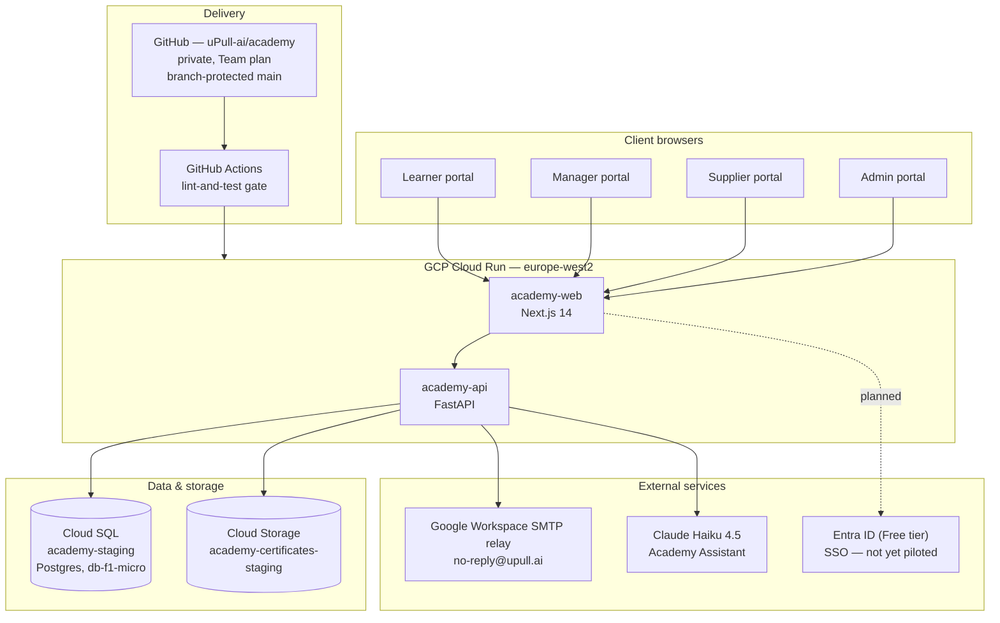
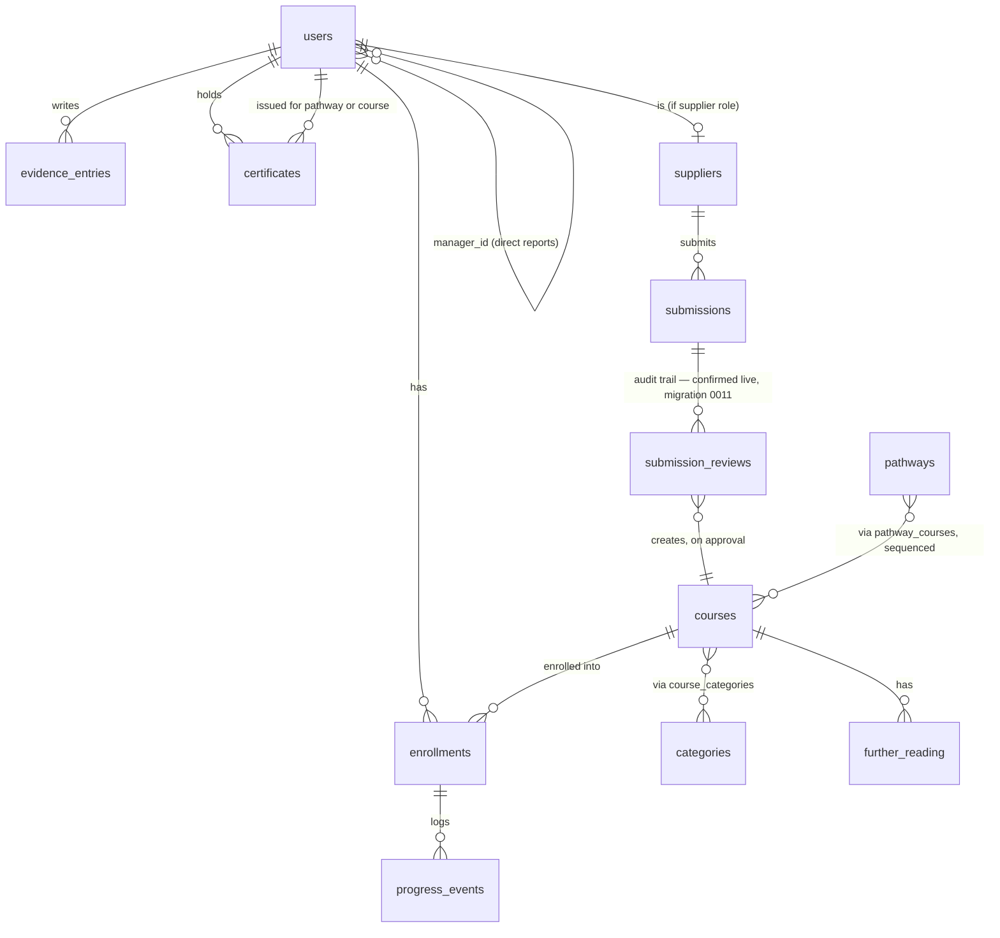

# uPull.ai Academy — architecture, design spec & procurement record

Consolidated reference, written 31 Aug 2026 so this can be handed to a
third party for scoping without needing a live session to reconstruct
context. Companion to [[academy-redesign-reference]] (the detailed
build log — every decision, commit and gotcha) and
[[course-approval-workflow-prototype]] (the sandboxed workflow test).
This document is the condensed, structural view; the reference doc is
the detailed history behind it.

**Updated 1 Sept 2026 (second pass)** — §6/§7 checked directly against
the real repo (`github.com/uPull-ai/academy`, linked Mac clone at
`/Users/acpy/Downloads/Claude/academy`), not just the test-status
handover. §12 added: certificates → badges reward-model change, staged
but not wired up, pending an award-logic decision.

## 1. What this is

A database-backed learning management system for NHS/UK healthcare staff
— "pull not push": staff choose what to learn, suppliers offer vetted
material, uPull's admin team curates it, managers see their team's
progress. Four separate portals rather than one role-switching UI, on the
premise that a learner, a line manager, a course supplier and a uPull
admin are doing genuinely different jobs.

## 2. System architecture

Backend: FastAPI, SQLAlchemy 2.0 ORM, Alembic migrations (**11 applied**,
`0001`–`0011`), Argon2 password hashing, httpOnly-cookie sessions,
role-generic `require_role(*roles)` RBAC gate on every write endpoint.
Frontend: Next.js 14 (App Router), server-only session helpers isolated
in `lib/session.ts` so nothing token-bearing reaches the client bundle.
Certificates: WeasyPrint HTML→PDF, rendered once at issuance, stored in
Cloud Storage, downloaded via a signed backend route so the token never
touches the client directly. **Under review — see §12.**

## 3. Roles and portals

| Role | Portal | Core capability |
|---|---|---|
| Guest | — | Browse published catalogue, no auth |
| Learner | Learner tool | Access material, mark in-progress/complete, add evidence, download certificates, join community discussions |
| Manager | Management tool | Reports on direct reports only (`manager_id` self-referential FK — not department-based); enhanced dashboard shows team and per-person learning/evidence totals |
| Supplier | Supplier tool | Submit course material — single form, and CSV bulk upload |
| Admin | Admin tool | Validate/verify submissions, manage topic/level taxonomy (admin-only, fixed), team & role management, org-wide reporting, community moderation |

CPD point tracking is schema-ready (`courses.cpd_points`) but explicitly
out of scope for this build phase — no endpoint reads or writes it.

## 4. Data model

Core tables as migrated: `users`, `password_reset_tokens`; `categories`,
`courses`, `course_categories`, `further_reading`, `pathways`,
`pathway_courses`; `suppliers`, `submissions`; `enrollments`,
`progress_events`, `evidence_entries`, `certificates`.

**`submission_reviews` — confirmed live in production**, migration
`0011_submission_review_audit.py` (commit `3fca19c`, 31 Aug 2026):
insert-only, `submission_id` / `reviewed_by` / `decision` (`approved` or
`rejected`, check-constrained) / `review_notes` / `course_id` (the course
created by *this specific* review, nullable) / `created_at`. Plus
`submissions.created_at`/`reviewed_at` added in the same migration. This
closes the audit-trail question this document was carrying as
unconfirmed — read directly from the migration file and
`routers/admin.py`, not inferred. Production's shape differs slightly
from the sandbox prototype (`course_id` lives on the review row itself,
not only on `submissions`; no separate mutable "current state" cache
fields on `submissions` beyond the two timestamps) but achieves the same
governance property: every decision is a permanent row, resubmission and
re-review both work without overwriting history.

## 5. Core workflows

**Registration & auth** — email/password, Argon2, first/last name required
at registration (so certificates carry a real name), httpOnly cookie
session, forgot/reset-password flow (single-use SHA-256 token, 1-hour
expiry) fully verified end-to-end including real SMTP delivery.

**Learner journey** — browse/filter published catalogue by topic and level
→ save/enrol → mark viewed/complete → optionally add reflective evidence
(private by default, opt-in to a community feed with moderation) →
reward issued on completion (certificate today; see §12 for the
badges change in progress). Confirmed tested 1 Sept 2026: catalogue
browsing, navigation, saving a course to "My learning".

**Supplier submission → review → publish** — see
[[course-approval-workflow-prototype]] for the original sandboxed state
diagram. **Confirmed live in production** (migration `0011`, commit
`3fca19c`, plus commits `a3e5b0e`/`619b593`/`400187e`/`75502e5`
hardening it further): admin approval and rejection both work correctly,
create a permanent `submission_reviews` row, and an approved course
appears in the learner catalogue — via a single-form submission and via
CSV bulk upload (commits `f3ba80f`, `cc3aadf`, `4da6767`).

**Manager view** — read-only reporting on direct reports' progress,
certificates and evidence. Enhanced dashboard live (commit `7dd74e2`,
latest on `main`): `managers@upull.ai` assigned as manager for four
learner accounts, team and per-person learning/evidence totals confirmed
showing correctly. Evidence marked `private` currently still surfaces to
the line manager by default — a deliberate but still unconfirmed product
decision (see §8).

**Community discussions** — general discussion posts, replies, author
revocation, evidence sharing, admin hide/unhide moderation. Live (commit
`1f34ebf`), confirmed tested 1 Sept 2026.

## 6. What's built and live today

Confirmed directly against `main` (`7dd74e2`) via the linked repo, not
just the test-status log:

- Auth + password reset, learner core, management tool (enhanced
  dashboard), admin portal (team & role management, hardened supplier
  review, org-wide reporting), supplier portal (single form **and** CSV
  bulk upload), evidence/community feed with moderation, community
  discussions, newsletter digest (SMTP live, first real send not yet
  triggered), learner-facing pathway view, certificate engine (branded
  PDF, stock-photo background — **under review, see §12**), Academy
  Assistant on Claude Haiku 4.5, full CI/CD with a required
  `lint-and-test` gate on `main`, role-aware navigation, submission
  review audit trail (`submission_reviews`, migration `0011`).
- Working tree on `main` is clean as of this check; nothing uncommitted
  or unpushed found other than the badge assets described in §12, which
  are deliberately left unstaged/uncommitted pending a decision.

Live catalogue content as last checked (31 Aug 2026): 24 published
courses, 7 topics, 3 levels, zero published pathways. Not re-checked as
part of this pass.

## 7. Gaps to close before "final product"

| Gap | Why it matters | Status |
|---|---|---|
| Certificates → badges reward model | See §12 — award-trigger logic not yet decided | Assets staged, not wired up |
| Manager self-service staff invitations | Managers currently can't assign/invite their own reports — needs existing-user assignment plus a secure emailed registration invitation, with acceptance, expiry and audit history | Not built — next recommended work |
| Admin bulk-approve for trusted suppliers | Natural hook is the existing `suppliers.verified` flag; must preserve one `submission_reviews` row per course even when approved as a batch | Idea only, not designed |
| Roundel brand migration | Certificate engine and all five doc deliverables are still wordmark-era; two real blockers (missing PNG exports, a third stray palette in circulation) — **note: the badge script in §12 already uses the correct roundel palette**, worth reusing as the reference implementation once the migration starts | Scoped, not started |
| Go-live checklist | Production domain/email settings, backup and restore check, monitoring/alerts, privacy review, controlled first newsletter send | Not started |
| SSO (Entra ID) | Reserved, not yet piloted | Deferred |
| mvp-18 team compliance export (CSV/PDF) | Flagged to managers in the Manager Guide as a known limitation | Not built |
| Session refresh | Token expiry works; no renewal without re-login | Deferred |
| CPD point tracking | Deliberately Phase 3 | Schema-ready, not scheduled |

**Resolved, confirmed directly against production code (1 Sept 2026)**:
course-approval audit trail (`submission_reviews`, migration `0011` —
see §4); supplier CSV bulk-upload (commits `f3ba80f`/`cc3aadf`/`4da6767`);
catalogue tags in `GET /courses`; course-creation-on-approve.

**Open product-backlog item, incompletely logged**: the 1 Sept 2026
handover's backlog list was numbered 1 and 5 only — items 2–4 weren't
captured in the source log. Worth asking whoever ran that test pass what
those were before they're lost.

## 8. Open decisions needing a founder call

Managed Postgres vs. staying on Cloud SQL; which SSO IdP to pilot first;
a target date to revisit CPD; whether `private`-visibility evidence
should keep surfacing to a line manager by default; whether an unset
course cost should default to "Free" by design; whether to commission
Prompt Engineering / Advanced-level content to close catalogue breadth
gaps; when to trigger the first live newsletter send; sequencing for the
roundel rebrand once its two blockers are resolved; sequencing for the
go-live checklist and manager self-service invitations against each
other; **the badge award-trigger decision in §12, which blocks any
backend work on the reward-model change**.

## 9. Procurement & registrations — what's actually paid for or set up

| Item | Detail | Billing |
|---|---|---|
| GCP project | `upull-ai-506306`, region `europe-west2` | ~£/mo — Cloud Run free tier, Cloud SQL `db-f1-micro` (ENTERPRISE edition), Cloud Storage, logging/CI free tier — ~$12/mo GCP total at MVP scale |
| Cloud SQL | Instance `academy-staging`, backups + PITR enabled | included above |
| GitHub | Org `uPull-ai`, private repo `academy`, **Team plan** (upgraded from free, 30 Aug 2026, to unlock branch protection) | $4/mo, invoiced separately by Alex to uPull.ai |
| Google Workspace | **Business Starter**, 1 licence, dedicated SMTP-sending mailbox `no-reply@upull.ai`, DKIM/SPF/DMARC all verified live | £5.90/user/month (annual commitment, monthly payment — £70.80/yr), invoiced separately by Alex, contract through 14 Sept 2027 |
| Domain | `upull.ai`, DNS on GoDaddy | (not itemised here — check registrar billing) |
| AI assistant | Claude Haiku 4.5, live in the Academy Assistant feature | per-token, GCP-side or Anthropic-side billing depending on integration — confirm which |
| SSO | Entra ID **Free tier** reserved, not yet piloted | £0 currently |

**Total known recurring cost outside GCP's own billing**: ~£4/mo (GitHub)
+ ~£5.90/mo (Workspace) ≈ **£9.90/month**, invoiced by Alex to uPull.ai
separately from the ~$12/mo GCP spend.

## 10. What a third-party scoper would need

If this goes out for external scoping: read access to `github.com/uPull-ai/academy`
(private — needs an invite), a copy of [[academy-redesign-reference]] and
this document, GCP project viewer access to `upull-ai-506306` (or just the
Cloud Run/Cloud SQL console screenshots if access shouldn't be granted
externally), and the five .docx guides already produced (System, Admin,
Manager, Learner, Course Library) as the closest thing to a functional
spec that exists today. The gaps table in §7 is the actual scope-of-work
starting point — everything else is either done or explicitly deferred by
decision, not by omission.

**Scoping should also budget usage, not just cost.** Alongside monetary
cost and time, any AI-assisted phase of work should carry an estimate of
how much of the available usage/compute allowance it will consume, with a
heads-up to whoever's running it once a phase crosses roughly 50/60/70%
of what's available — so other work can be sequenced around it rather
than discovered only once a session runs out mid-task. Worth building
into how uPull frames AI-adoption scoping for clients generally, not just
this project.

## 11. Document map

- [[academy-redesign-reference]] — full build history, every decision and
  gotcha, updated as work lands. The primary source; long, so use
  `project_search` for a specific fact rather than reading it whole.
- [[course-approval-workflow-prototype]] — the sandboxed workflow test
  behind part of §7, plus future-functionality ideas captured there.
- [[brand-guide]] — roundel identity spec (canonical), wordmark identity
  kept as legacy reference.
- This document — structural overview, procurement record, scoping
  starting point.

## 12. Reward model change: certificates → badges (raised 1 Sept 2026)

**Decision stated**: badges replace certificates as the completion
reward. A generator script was supplied (Python, using `cairosvg`-style
plain-SVG output, no external deps beyond the stdlib) implementing 21
badges — one per topic category (the same 7 as `seed_dev.py`'s
`TOPIC_LABELS`) × 3 levels (beginner/intermediate/advanced) — in the
canonical roundel brand palette (`#0C1726` navy field, `#F08A0C` orange
as the only accent).

**What's been done, staged but not committed or wired up**, on the linked
Mac's real clone at `/Users/acpy/Downloads/Claude/academy`:

- Script saved to `backend/scripts/generate_badges.py` (adapted from the
  supplied version — filenames simplified from
  `{category}_{level}_{title-slug}.svg` to `{category}_{level}.svg`, so
  application code has a stable key independent of the badge's display
  title; bullet-point level labels ("Level 1 • Explorer") preserved
  exactly as supplied).
- Run successfully — 21 SVGs generated into
  `backend/app/assets/badges/` (mirrors the existing
  `certificate_backgrounds/` convention).
- Visually verified by rendering three sample badges to PNG and
  inspecting them (`agentic_advanced`, `ambient_beginner`,
  `clinical_advanced`, `intrapreneur_advanced`): brand palette correct,
  the beginner/intermediate/advanced ring-weight and colour progression
  reads clearly, layout is clean.
- **One real fragility found**: the script's own comment claims the
  title text is "auto-wrapped for long strings", but there is no wrapping
  logic — it's a single fixed-position `<text>` element. The longest
  current title, "One Architecture Model Expert" (Clinical, advanced),
  renders with very little clearance inside the ring — not clipped today,
  but a future badge title of similar or greater length would clip.
  Worth adding real wrapping (or a character-count guard) before this is
  treated as final, not just for the 21 titles that happen to fit now.
- **Nothing else touched.** `enrollments.py`'s `mark_complete` (which
  currently calls `issue_certificate_for_completion` once per course
  completion) and `certificate_service.py` are unmodified. No migration
  for a `badges`/`badge_awards` table exists yet.

**Why nothing was wired up**: certificates and badges are not a like-for-like
swap. A certificate is issued **per course, per completion** — a 1:1,
unambiguous trigger already implemented. A badge as designed here is
**per category, per level** (21 total, not one per course) — a
fundamentally different unit that has no defined trigger yet. Before any
backend logic gets written, this needs an actual decision:

1. What earns a badge — completing every published course tagged with
   that category and level? Completing any single course tagged with
   that category and level (first one unlocks it)? A curated/admin-set
   list distinct from course tagging altogether?
2. Do badges **replace** certificates outright (remove the WeasyPrint
   PDF issuance and its completion email), or do the two coexist
   (certificate per course, badge per category/level milestone)?
3. What happens to certificates already issued to real learners in
   `academy-staging` if certificates are being retired — kept as
   historical records, or actively migrated/represented as badges
   retroactively?

Writing `mark_complete`/a new award-service/a migration against any one
guess at these would risk building the wrong trigger against a live
database with real learner data. Flagging back rather than guessing.
