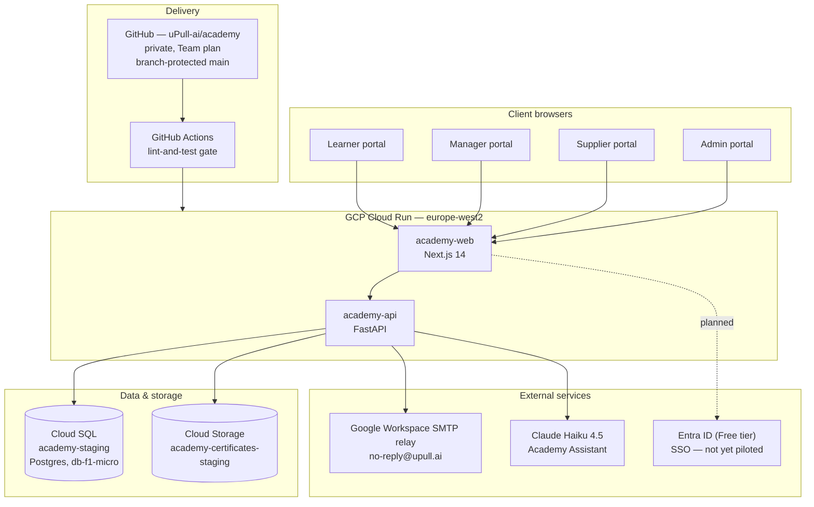
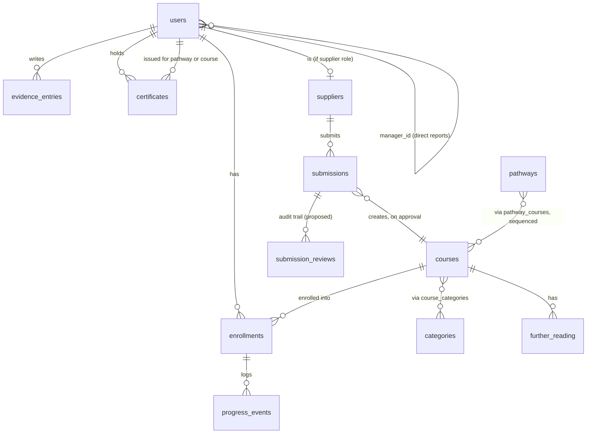

Architecture design spec · MD
# uPull.ai Academy — architecture, design spec & procurement record
 
Consolidated reference, written 31 Aug 2026 so this can be handed to a
third party for scoping without needing a live session to reconstruct
context. Companion to [[academy-redesign-reference]] (the detailed
build log — every decision, commit and gotcha) and
[[course-approval-workflow-prototype]] (the sandboxed workflow test).
This document is the condensed, structural view; the reference doc is
the detailed history behind it.
 
## 1. What this is
 
A database-backed learning management system for NHS/UK healthcare staff
— "pull not push": staff choose what to learn, suppliers offer vetted
material, uPull's admin team curates it, managers see their team's
progress. Four separate portals rather than one role-switching UI, on the
premise that a learner, a line manager, a course supplier and a uPull
admin are doing genuinely different jobs.
 
## 2. System architecture
 

 
Backend: FastAPI, SQLAlchemy 2.0 ORM, Alembic migrations (10 applied to
date, `0001`–`0010`), Argon2 password hashing, httpOnly-cookie sessions,
role-generic `require_role(*roles)` RBAC gate on every write endpoint.
Frontend: Next.js 14 (App Router), server-only session helpers isolated
in `lib/session.ts` so nothing token-bearing reaches the client bundle.
Certificates: WeasyPrint HTML→PDF, rendered once at issuance, stored in
Cloud Storage, downloaded via a signed backend route so the token never
touches the client directly.
 
## 3. Roles and portals
 
| Role | Portal | Core capability |
|---|---|---|
| Guest | — | Browse published catalogue, no auth |
| Learner | Learner tool | Access material, mark in-progress/complete, add evidence, download certificates |
| Manager | Management tool | Reports on direct reports only (`manager_id` self-referential FK — not department-based) |
| Supplier | Supplier tool | Submit course material (form today; CSV bulk-upload scoped, not built) |
| Admin | Admin tool | Validate/verify submissions, manage topic/level taxonomy (admin-only, fixed), team & role management, org-wide reporting |
 
CPD point tracking is schema-ready (`courses.cpd_points`) but explicitly
out of scope for this build phase — no endpoint reads or writes it.
 
## 4. Data model
 

 
Core tables as migrated: `users`, `password_reset_tokens`; `categories`,
`courses`, `course_categories`, `further_reading`, `pathways`,
`pathway_courses`; `suppliers`, `submissions`; `enrollments`,
`progress_events`, `evidence_entries`, `certificates`. `submission_reviews`
(insert-only audit trail) plus `submissions.created_at`/`reviewed_at` were
designed and proven in the sandboxed prototype — **not yet confirmed
present in production**, see §7.
 
## 5. Core workflows
 
**Registration & auth** — email/password, Argon2, first/last name required
at registration (so certificates carry a real name), httpOnly cookie
session, forgot/reset-password flow (single-use SHA-256 token, 1-hour
expiry) fully verified end-to-end including real SMTP delivery.
 
**Learner journey** — browse/filter published catalogue by topic and level
→ save/enrol → mark viewed/complete → optionally add reflective evidence
(private by default, opt-in to a community feed with moderation) →
certificate auto-issued and emailed on completion.
 
**Supplier submission → review → publish** — see
[[course-approval-workflow-prototype]] for the full state diagram and the
governance gaps that mock-up found (approval not creating a `Course` row;
no audit trail on reject/approve decisions; no resubmission path after
rejection) and the fixes proven there. **Status in production: unconfirmed**
— `routers/admin.py`'s `review_submission` already emails the supplier on
both outcomes (commit `a0340c5`), but whether it currently creates the
`Course` row and preserves a decision history has not yet been checked
against the real code.
 
**Manager view** — read-only reporting on direct reports' progress,
certificates and evidence; evidence marked `private` currently still
surfaces to the line manager by default — a deliberate but still
unconfirmed product decision (see §8).
 
## 6. What's built and live today (condensed — see [[academy-redesign-reference]] for full detail)
 
Complete and deployed: auth + password reset, learner core, management
tool, admin portal (incl. team & role management), supplier portal
(single-submission form only), evidence/community feed with moderation,
newsletter digest (built, SMTP live, first real send not yet triggered),
learner-facing pathway view, certificate engine (branded PDF, stock-photo
background, four vetted images rotated per render), Academy Assistant on
Claude Haiku 4.5 querying Postgres directly, full CI/CD with a required
`lint-and-test` gate on `main`.
 
Live catalogue content as last checked (31 Aug 2026): 24 published
courses, 7 topics, 3 levels, zero published pathways.
 
## 7. Gaps to close before "final product"
 
| Gap | Why it matters | Status |
|---|---|---|
| Course-creation-on-approve & audit trail | Governance-critical for an NHS-facing platform — needs verifying against real `admin.py`, not assumed present or absent | Prototyped only, unconfirmed in prod |
| Supplier CSV bulk-upload | Scoped (Phase 2/2.5) but not started; raised again this week as a real near-term want | Not started |
| Admin bulk-approve for trusted suppliers | New idea (31 Aug 2026) — natural hook is the existing unused `suppliers.verified` flag; must preserve one audit row per course even when approved as a batch | Idea only, not designed |
| Catalogue tags never populate in `GET /courses` | Same class of bug as the `CourseCategory`/`PathwayCourse` fix already shipped in prod (`50def65`) — worth re-checking whether the equivalent still exists on the tags path | Found in prototype, prod status unknown |
| Roundel brand migration | Certificate engine and all five doc deliverables are still wordmark-era; two real blockers (missing PNG exports, a third stray palette in circulation) need resolving first | Scoped, not started |
| Supplier CSV bulk-upload, SSO (Entra ID) | Both Phase 2/2.5 | Not started |
| Newsletter first live send | Built, SMTP confirmed working, genuine mass-send — needs an explicit go-ahead each time it's raised | Not triggered |
| mvp-18 team compliance export (CSV/PDF) | Flagged to managers in the Manager Guide as a known limitation | Not built |
| Session refresh | Token expiry works; no renewal without re-login | Deferred |
| CPD point tracking | Deliberately Phase 3 | Schema-ready, not scheduled |
 
## 8. Open decisions needing a founder call
 
Managed Postgres vs. staying on Cloud SQL; which SSO IdP to pilot first;
a target date to revisit CPD; whether `private`-visibility evidence
should keep surfacing to a line manager by default; whether an unset
course cost should default to "Free" by design; whether to commission
Prompt Engineering / Advanced-level content to close catalogue breadth
gaps; when to trigger the first live newsletter send; sequencing for the
roundel rebrand once its two blockers are resolved.
 
## 9. Procurement & registrations — what's actually paid for or set up
 
| Item | Detail | Billing |
|---|---|---|
| GCP project | `upull-ai-506306`, region `europe-west2` | ~£/mo — Cloud Run free tier, Cloud SQL `db-f1-micro` (ENTERPRISE edition), Cloud Storage, logging/CI free tier — ~$12/mo GCP total at MVP scale |
| Cloud SQL | Instance `academy-staging`, backups + PITR enabled | included above |
| GitHub | Org `uPull-ai`, private repo `academy`, **Team plan** (upgraded from free, 30 Aug 2026, to unlock branch protection) | $4/mo, invoiced separately by Alex to uPull.ai |
| Google Workspace | **Business Starter**, 1 licence, dedicated SMTP-sending mailbox `no-reply@upull.ai`, DKIM/SPF/DMARC all verified live; downgraded from Business Plus before paid billing started once Vault/advanced endpoint management were confirmed unneeded | £5.90/user/month (annual commitment, monthly payment — £70.80/yr), invoiced separately by Alex, contract through 14 Sept 2027 |
| Domain | `upull.ai`, DNS on GoDaddy | (not itemised here — check registrar billing) |
| AI assistant | Claude Haiku 4.5, live in the Academy Assistant feature | per-token, GCP-side or Anthropic-side billing depending on integration — confirm which |
| SSO | Entra ID **Free tier** reserved, not yet piloted | £0 currently |
 
**Total known recurring cost outside GCP's own billing**: ~£4/mo (GitHub)
+ ~£5.90/mo (Workspace) ≈ **£9.90/month**, invoiced by Alex to uPull.ai
separately from the ~$12/mo GCP spend. Worth a single consolidated
figure next time this is reviewed, since it currently sits across two
invoicing paths.
## 10. What a third-party scoper would need
 
If this goes out for external scoping: read access to `github.com/uPull-ai/academy`
(private — needs an invite), a copy of [[academy-redesign-reference]] and
this document, GCP project viewer access to `upull-ai-506306` (or just the
Cloud Run/Cloud SQL console screenshots if access shouldn't be granted
externally), and the five .docx guides already produced (System, Admin,
Manager, Learner, Course Library) as the closest thing to a functional
spec that exists today. The gaps table in §7 is the actual scope-of-work
starting point — everything else is either done or explicitly deferred by
decision, not by omission.
 
## 11. Document map
 
- [[academy-redesign-reference]] — full build history, every decision and
  gotcha, updated as work lands. The primary source; long, so use
  `project_search` for a specific fact rather than reading it whole.
- [[course-approval-workflow-prototype]] — the sandboxed workflow test
  behind §7's top row, plus the two future-functionality ideas in §7.
- [[brand-guide]] — roundel identity spec (canonical), wordmark identity
  kept as legacy reference.
- This document — structural overview, procurement record, scoping
  starting point.
 

