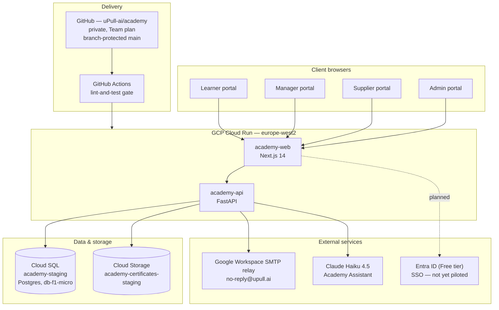
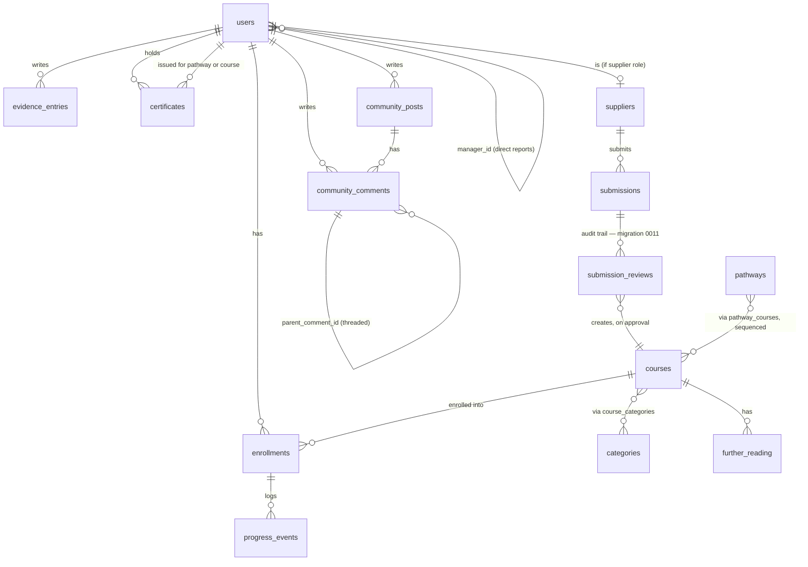

# uPull.ai Academy — architecture, design spec & procurement record

Consolidated reference, written 31 Aug 2026 so this can be handed to a
third party for scoping without needing a live session to reconstruct
context. Companion to [[academy-redesign-reference]] (the detailed
build log — every decision, commit and gotcha) and
[[course-approval-workflow-prototype]] (the sandboxed workflow test).
This document is the condensed, structural view; the reference doc is
the detailed history behind it.

**Updated 1 Sept 2026 (third pass)** — §4/§5/§6/§7 cross-marked against
a formal delivery-evidence log (§13): commit timestamps, GitHub Actions
run links, and HTTP-200 checks against the live URLs. Anywhere a row
below is backed by that evidence carries an **[Evidence §13]** marker.

## 1. What this is

A database-backed learning management system for NHS/UK healthcare staff
— "pull not push": staff choose what to learn, suppliers offer vetted
material, uPull's admin team curates it, managers see their team's
progress. Four separate portals rather than one role-switching UI, on the
premise that a learner, a line manager, a course supplier and a uPull
admin are doing genuinely different jobs.

## 2. System architecture



Backend: FastAPI, SQLAlchemy 2.0 ORM, Alembic migrations (**13 applied**,
`0001`–`0013` — see §4), Argon2 password hashing, httpOnly-cookie
sessions, role-generic `require_role(*roles)` RBAC gate on every write
endpoint. Frontend: Next.js 14 (App Router), server-only session helpers
isolated in `lib/session.ts` so nothing token-bearing reaches the client
bundle. Certificates: WeasyPrint HTML→PDF, rendered once at issuance,
stored in Cloud Storage, downloaded via a signed backend route so the
token never touches the client directly. **Under review — see §12.**

**Live URLs [Evidence §13]**: web app `https://academy-web-cnwpiir5eq-nw.a.run.app`,
API + Swagger docs `https://academy-api-cnwpiir5eq-nw.a.run.app/docs`.
Independently confirmed 1 Sept 2026 by opening the web URL directly and
reading the rendered catalogue (24 courses, correct topic tags, sign-in
present) — a stronger check than an HTTP-200 alone, since it confirms the
page actually renders real data rather than just responding.

## 3. Roles and portals

| Role | Portal | Core capability |
|---|---|---|
| Guest | — | Browse published catalogue, no auth |
| Learner | Learner tool | Access material, mark in-progress/complete, add evidence, download certificates, join community discussions |
| Manager | Management tool | Reports on direct reports only (`manager_id` self-referential FK — not department-based); enhanced dashboard shows team and per-person learning/evidence totals **[Evidence §13]** |
| Supplier | Supplier tool | Submit course material — single form, and CSV bulk upload **[Evidence §13]** |
| Admin | Admin tool | Validate/verify submissions, manage topic/level taxonomy (admin-only, fixed), team & role management, org-wide reporting, community moderation **[Evidence §13]** |

CPD point tracking is schema-ready (`courses.cpd_points`) but explicitly
out of scope for this build phase — no endpoint reads or writes it.

## 4. Data model



Core tables as migrated: `users`, `password_reset_tokens`; `categories`,
`courses`, `course_categories`, `further_reading`, `pathways`,
`pathway_courses`; `suppliers`, `submissions`; `enrollments`,
`progress_events`, `evidence_entries`, `certificates`.

**`submission_reviews`** — confirmed live, migration
`0011_submission_review_audit.py` (commit `3fca19c`, 31 Aug 2026):
insert-only, `submission_id` / `reviewed_by` / `decision` (`approved` or
`rejected`, check-constrained) / `review_notes` / `course_id` (the course
created by *this specific* review, nullable) / `created_at`. Plus
`submissions.created_at`/`reviewed_at`. Closes the audit-trail question
this document previously carried as unconfirmed.

**`courses.external_course_id` / `courses.study_length_hours`** — added
migration `0012_course_supplier_reference.py` (commit `cc3aadf`,
1 Sept 2026) **[Evidence §13]**, both nullable. Backs the supplier CSV
bulk-upload format (see §5): `course_id` in the CSV is optional and maps
to `external_course_id` — the supplier's own reference, not uPull's
internal UUID — and `study_length` (hours) maps to `study_length_hours`.

**`community_posts`** (`id`, `user_id`, `title`, `topic`, `body`,
`created_at`, `revoked_at`, `hidden_at`) and **`community_comments`**
(`id`, `post_id`, `user_id`, `parent_comment_id` for threaded replies,
`body`, `created_at`, `revoked_at`, `hidden_at`) — added migration
`0013_community_discussions.py` (commit `1f34ebf`, 1 Sept 2026)
**[Evidence §13]**. Both use nullable timestamp columns for
revoke/hide rather than booleans — the same "moderation flag as a
nullable timestamp, doubling as an audit trail" pattern already used for
`evidence_entries.hidden_at`.

## 5. Core workflows

**Registration & auth** — email/password, Argon2, first/last name required
at registration (so certificates carry a real name), httpOnly cookie
session, forgot/reset-password flow (single-use SHA-256 token, 1-hour
expiry) fully verified end-to-end including real SMTP delivery.

**Learner journey** — browse/filter published catalogue by topic and level
→ save/enrol → mark viewed/complete → optionally add reflective evidence
(private by default, opt-in to a community feed with moderation) →
reward issued on completion (certificate today; see §12 for the
badges change in progress). Confirmed tested 1 Sept 2026: catalogue
browsing, navigation, saving a course to "My learning".

**Supplier submission → review → publish** — see
[[course-approval-workflow-prototype]] for the original sandboxed state
diagram. **Confirmed live [Evidence §13]**: admin approval and rejection
both work correctly, create a permanent `submission_reviews` row, and an
approved course appears in the learner catalogue — via a single-form
submission and via CSV bulk upload. The CSV format (commits `f3ba80f` →
`cc3aadf` → `4da6767`, migration `0012`):

```text
course_id,title,description,url,cost,categories,level,study_length
```

`course_id` and `study_length` are optional; `categories` accepts
comma-separated multi-values; `level` is stored as a tag. A four-course
CSV upload was tested end to end: submitted → created pending
submissions → admin approved/rejected → approved courses appeared in the
learner catalogue → saved and completed by a learner. Automated coverage:
`backend/tests/test_bulk_csv.py`.

**Manager view** — read-only reporting on direct reports' progress,
certificates and evidence. Enhanced dashboard **live [Evidence §13]**
(commit `7dd74e2`): `managers@upull.ai` assigned as manager for four
learner accounts, team and per-person learning/evidence totals confirmed
showing correctly. Evidence marked `private` currently still surfaces to
the line manager by default — a deliberate but still unconfirmed product
decision (see §8).

**Community discussions** — general discussion posts, replies (threaded
via `parent_comment_id`), author-side post/comment revocation, evidence
sharing, admin hide/unhide moderation. **Live [Evidence §13]** (commit
`1f34ebf`, migration `0013`): post/reply creation, author revocation and
admin moderation all tested successfully.

## 6. What's built and live today

Confirmed directly against `main` via the linked repo and cross-marked
against the delivery-evidence log (§13):

- Auth + password reset, learner core, management tool (enhanced
  dashboard **[Evidence §13]**), admin portal (team & role management,
  hardened supplier review **[Evidence §13]**, org-wide reporting),
  supplier portal (single form **and** CSV bulk upload **[Evidence §13]**),
  evidence/community feed with moderation, community discussions
  **[Evidence §13]**, newsletter digest (SMTP live, first real send not
  yet triggered), learner-facing pathway view, certificate engine
  (branded PDF, stock-photo background — **under review, see §12**),
  Academy Assistant on Claude Haiku 4.5, full CI/CD with a required
  `lint-and-test` gate on `main` **[Evidence §13 — 8 green Actions
  runs cited]**, role-aware navigation (learners no longer see
  Supplier/Management links **[Evidence §13]**), submission review audit
  trail (`submission_reviews`, migration `0011`).
- Working tree on `main` is clean; nothing uncommitted or unpushed other
  than the badge assets described in §12, deliberately left staged and
  uncommitted pending a decision.

Live catalogue content as last checked (31 Aug 2026): 24 published
courses, 7 topics, 3 levels, zero published pathways. Not re-checked
against the current count as part of this pass.

## 7. Gaps to close before "final product"

| Gap | Why it matters | Status |
|---|---|---|
| Certificates → badges reward model | See §12 — award-trigger logic not yet decided | Assets staged, not wired up. **Confirmed still not deployed — Evidence §13 §4** |
| Manager self-service staff invitations | Managers currently can't assign/invite their own reports — needs existing-user assignment plus a secure emailed registration invitation, with acceptance, expiry and audit history | Not built — next recommended work. **Confirmed still not deployed — Evidence §13 §4** |
| Admin bulk-approve for trusted suppliers | Natural hook is the existing `suppliers.verified` flag; must preserve one `submission_reviews` row per course even when approved as a batch | Idea only, not designed |
| Roundel brand migration | Certificate engine and all five doc deliverables are still wordmark-era; two real blockers (missing PNG exports, a third stray palette in circulation) — the badge script in §12 already uses the correct roundel palette, worth reusing as reference | Scoped, not started. **Confirmed still not deployed — Evidence §13 §4** |
| Go-live checklist | Production domain/email settings, backup and restore check, monitoring/alerts, privacy review, controlled first newsletter send | Not started |
| SSO (Entra ID) | Reserved, not yet piloted | Deferred. **Confirmed still not deployed — Evidence §13 §4** |
| mvp-18 team compliance export (CSV/PDF) | Flagged to managers in the Manager Guide as a known limitation | Not built |
| Session refresh | Token expiry works; no renewal without re-login | Deferred |
| CPD point tracking | Deliberately Phase 3 | Schema-ready, not scheduled. **Confirmed still not deployed — Evidence §13 §4** |

**Resolved and evidenced [Evidence §13]**: course-approval audit trail
(`submission_reviews`, migration `0011`); supplier CSV bulk-upload
(migration `0012`, commits `f3ba80f`/`cc3aadf`/`4da6767`, GitHub Actions
runs cited); catalogue tags in `GET /courses`; course-creation-on-approve;
community discussions (migration `0013`, commit `1f34ebf`); manager
dashboard enhancement (commit `7dd74e2`); admin bootstrap and role-aware
navigation (commits `619b593`/`400187e`/`75502e5`).

**Open product-backlog item, incompletely logged**: an earlier
test-status handover's backlog list was numbered 1 and 5 only — items
2–4 weren't captured in that source log. Worth asking whoever ran that
test pass what those were before they're lost.

## 8. Open decisions needing a founder call

Managed Postgres vs. staying on Cloud SQL; which SSO IdP to pilot first;
a target date to revisit CPD; whether `private`-visibility evidence
should keep surfacing to a line manager by default; whether an unset
course cost should default to "Free" by design; whether to commission
Prompt Engineering / Advanced-level content to close catalogue breadth
gaps; when to trigger the first live newsletter send; sequencing for the
roundel rebrand once its two blockers are resolved; sequencing for the
go-live checklist and manager self-service invitations against each
other; the badge award-trigger decision in §12, which blocks any backend
work on the reward-model change.

## 9. Procurement & registrations — what's actually paid for or set up

| Item | Detail | Billing |
|---|---|---|
| GCP project | `upull-ai-506306`, region `europe-west2` | ~£/mo — Cloud Run free tier, Cloud SQL `db-f1-micro` (ENTERPRISE edition), Cloud Storage, logging/CI free tier — ~$12/mo GCP total at MVP scale |
| Cloud SQL | Instance `academy-staging`, backups + PITR enabled | included above |
| GitHub | Org `uPull-ai`, private repo `academy`, **Team plan** (upgraded from free, 30 Aug 2026, to unlock branch protection) | $4/mo, invoiced separately by Alex to uPull.ai |
| Google Workspace | **Business Starter**, 1 licence, dedicated SMTP-sending mailbox `no-reply@upull.ai`, DKIM/SPF/DMARC all verified live | £5.90/user/month (annual commitment, monthly payment — £70.80/yr), invoiced separately by Alex, contract through 14 Sept 2027 |
| Domain | `upull.ai`, DNS on GoDaddy | (not itemised here — check registrar billing) |
| AI assistant | Claude Haiku 4.5, live in the Academy Assistant feature | per-token, GCP-side or Anthropic-side billing depending on integration — confirm which |
| SSO | Entra ID **Free tier** reserved, not yet piloted | £0 currently |

**Total known recurring cost outside GCP's own billing**: ~£4/mo (GitHub)
+ ~£5.90/mo (Workspace) ≈ **£9.90/month**, invoiced by Alex to uPull.ai
separately from the ~$12/mo GCP spend.

## 10. What a third-party scoper would need

If this goes out for external scoping: read access to `github.com/uPull-ai/academy`
(private — needs an invite), a copy of [[academy-redesign-reference]] and
this document, GCP project viewer access to `upull-ai-506306` (or just the
Cloud Run/Cloud SQL console screenshots if access shouldn't be granted
externally), and the five .docx guides already produced (System, Admin,
Manager, Learner, Course Library) as the closest thing to a functional
spec that exists today. The gaps table in §7 is the actual scope-of-work
starting point — everything else is either done or explicitly deferred by
decision, not by omission.

**Scoping should also budget usage, not just cost.** Alongside monetary
cost and time, any AI-assisted phase of work should carry an estimate of
how much of the available usage/compute allowance it will consume, with a
heads-up to whoever's running it once a phase crosses roughly 50/60/70%
of what's available — so other work can be sequenced around it rather
than discovered only once a session runs out mid-task.

## 11. Document map

- [[academy-redesign-reference]] — full build history, every decision and
  gotcha, updated as work lands. The primary source; long, so use
  `project_search` for a specific fact rather than reading it whole.
- [[course-approval-workflow-prototype]] — the sandboxed workflow test
  behind part of §7, plus future-functionality ideas captured there.
- [[brand-guide]] — roundel identity spec (canonical), wordmark identity
  kept as legacy reference.
- This document — structural overview, procurement record, scoping
  starting point, cross-marked against §13's delivery evidence.
- **Not yet reconciled**: a separately-prepared file named
  `academy_architecture_design_update_2026-09-01.md` is referenced in the
  §13 evidence log (§5 there) as "upload-ready" but was not supplied to
  this session and has not been pushed anywhere. Worth checking its
  contents against this document before both are treated as current —
  two diverging "architecture update" documents is worse than one, even
  an imperfect one.

## 12. Reward model change: certificates → badges (raised 1 Sept 2026)

**Decision stated**: badges replace certificates as the completion
reward. A generator script was supplied (Python, plain-SVG output, no
external deps beyond the stdlib) implementing 21 badges — one per topic
category (the same 7 as `seed_dev.py`'s `TOPIC_LABELS`) × 3 levels
(beginner/intermediate/advanced) — in the canonical roundel brand palette
(`#0C1726` navy field, `#F08A0C` orange as the only accent).

**What's been done, staged but not committed or wired up**, on the linked
Mac's real clone at `/Users/acpy/Downloads/Claude/academy`:

- Script saved to `backend/scripts/generate_badges.py` (adapted from the
  supplied version — filenames simplified from
  `{category}_{level}_{title-slug}.svg` to `{category}_{level}.svg`, so
  application code has a stable key independent of the badge's display
  title; bullet-point level labels ("Level 1 • Explorer") preserved
  exactly as supplied).
- Run successfully — 21 SVGs generated into `backend/app/assets/badges/`
  (mirrors the existing `certificate_backgrounds/` convention).
- Visually verified by rendering sample badges to PNG and inspecting
  them: brand palette correct, the beginner/intermediate/advanced
  ring-weight and colour progression reads clearly, layout is clean.
- **One real fragility found**: the script's own comment claims the
  title text is "auto-wrapped for long strings", but there is no wrapping
  logic. The longest current title, "One Architecture Model Expert"
  (Clinical, advanced), renders with very little clearance inside the
  ring — not clipped today, but a future longer title would clip.
- **Nothing else touched.** `enrollments.py`'s `mark_complete` and
  `certificate_service.py` are unmodified. No `badges`/`badge_awards`
  migration exists yet.

**Why nothing was wired up**: certificates are issued **per course, per
completion** — a 1:1, already-implemented trigger. Badges as designed
here are **per category, per level** (21 total, not one per course) — a
fundamentally different unit with no defined trigger. Before backend
logic gets written:

1. What earns a badge — completing every published course tagged with
   that category and level? Completing any single one (first unlocks
   it)? A curated/admin-set list distinct from course tagging?
2. Do badges **replace** certificates outright (remove WeasyPrint
   issuance and its completion email), or coexist?
3. What happens to certificates already issued to real learners in
   `academy-staging` if certificates are retired?

§13 §4 (delivery evidence, 1 Sept 2026) independently confirms this is
still correctly listed as designed-not-deployed — consistent with the
state recorded here.

## 13. Delivery evidence (captured 1 Sept 2026, Hong Kong, UTC+08:00)

Verbatim record supplied for this update, preserved as the auditable
source behind the **[Evidence §13]** markers used above. Where this
session independently re-checked a claim, that's noted; the commit
timestamps and GitHub Actions run links below were not independently
re-verified (would require `gh` CLI access this session doesn't have)
and are recorded as supplied.

### 13.1 Live deployment locations

| Service | Location | Verification at evidence capture |
|---|---|---|
| Learner/manager/supplier/admin web application | https://academy-web-cnwpiir5eq-nw.a.run.app/ | HTTP 200 (independently re-confirmed this session by loading the page and reading real rendered catalogue content) |
| Academy API documentation | https://academy-api-cnwpiir5eq-nw.a.run.app/docs | HTTP 200 |
| Source repository | https://github.com/uPull-ai/academy | Private GitHub repository, `main` branch |
| Delivery record | https://github.com/uPull-ai/academy/actions | GitHub Actions CI/CD runs |

### 13.2 Deployment evidence

All entries below completed successfully in GitHub Actions and deployed
through the Academy CI/CD pipeline to Cloud Run.

| Work item | Source commit | Commit time (HK) | Deployment completed (UTC) | GitHub Actions evidence |
|---|---|---|---|---|
| Manager learning dashboard | `7dd74e2` | 1 Sep 2026, 10:17:00 +08:00 | 1 Sep 2026, 02:24:11 UTC | [run 33461988012](https://github.com/uPull-ai/academy/actions/runs/33461988012) |
| Community discussions and moderation | `1f34ebf` | 1 Sep 2026, 10:05:53 +08:00 | 1 Sep 2026, 02:14:38 UTC | [run 33461358449](https://github.com/uPull-ai/academy/actions/runs/33461358449) |
| Supplier CSV upload guidance in the portal | `4da6767` | 1 Sep 2026, 09:48:52 +08:00 | 1 Sep 2026, 01:56:02 UTC | [run 33460238748](https://github.com/uPull-ai/academy/actions/runs/33460238748) |
| Supplier CSV importer upgrade | `cc3aadf` | 1 Sep 2026, 09:31:35 +08:00 | 1 Sep 2026, 01:38:56 UTC | [run 33459145624](https://github.com/uPull-ai/academy/actions/runs/33459145624) |
| Initial supplier CSV bulk upload | `f3ba80f` | 1 Sep 2026, 07:56:12 +08:00 | 1 Sep 2026, 00:02:59 UTC | [run 33452741818](https://github.com/uPull-ai/academy/actions/runs/33452741818) |
| Role-aware navigation and clearer supplier errors | `75502e5` | 31 Aug 2026, 23:32:16 +08:00 | 31 Aug 2026, 15:39:19 UTC | [run 33409011694](https://github.com/uPull-ai/academy/actions/runs/33409011694) |
| Role testing-flow fixes | `400187e` | 31 Aug 2026, 23:12:33 +08:00 | 31 Aug 2026, 15:19:06 UTC | [run 33407121002](https://github.com/uPull-ai/academy/actions/runs/33407121002) |
| Academy administrator bootstrap | `619b593` | 31 Aug 2026, 22:54:12 +08:00 | 31 Aug 2026, 15:00:53 UTC | [run 33405372968](https://github.com/uPull-ai/academy/actions/runs/33405372968) |

### 13.3 What the delivered changes contain

**Supplier CSV upload** — importer and portal guide changed across
backend, frontend, migration and automated tests. Format:
`course_id,title,description,url,cost,categories,level,study_length`
(`course_id`/`study_length` optional; `categories` comma-separated;
`level` stored as a tag; study length in hours). Migration `0012`
(independently read this session — see §4), `backend/tests/test_bulk_csv.py`
(independently confirmed present this session). Testing evidence: a
four-course CSV upload created pending submissions; admin approval/
rejection tested; approved courses appeared in the learner catalogue and
were saved and completed by a learner.

**Community knowledge sharing** — commit `1f34ebf` added backend models,
migration `0013` (independently read this session — see §4), protected
API routes, and the Community frontend component. Functions: general
posts, replies, author post revocation, evidence sharing, admin
hide/unhide moderation. Testing evidence: post/reply creation, author
revocation and admin moderation tested successfully.

**Manager dashboard** — commit `7dd74e2` enhanced the live Management
page with team and individual learning/evidence totals. Model remains
direct-report based via `manager_id`. Testing evidence: one manager
assigned four learner accounts, dashboard reviewed and signed off.

**Earlier role and approval fixes** — the 31 Aug deployment sequence
included admin bootstrap, role-testing fixes and role-aware navigation.
Testing confirmed learner accounts no longer see Supplier/Management
links, supplier organisation validation is active, and approval/
rejection publishes approved material to the learner catalogue.

### 13.4 Items not represented as deployed work

Documented requirements or designed work, not live deployment claims:
manager self-service staff invitations by email; replacement of learner
certificates with badge awards (see §12); roundel brand migration across
Academy screens and emails; first real newsletter send; Entra ID SSO and
CPD tracking. Consistent with §7/§8's own gap tracking — cross-checked,
no discrepancy found.

### 13.5 Documentation update location (as supplied — not yet reconciled)

The evidence log states an updated architecture/design specification was
prepared separately as `academy_architecture_design_update_2026-09-01.md`,
upload-ready but deliberately not pushed into the live app or the
`uPull-ai/web` repository pending owner review. **This file was not
supplied to this session** — see the flag in §11. Do not treat this
document (the one you're reading) as that file; they may overlap or
diverge and haven't been compared.

### 13.6 Reproducible checks (as supplied)

```bash
git log --date=iso-strict --pretty=format:'%h|%ad|%s'
gh run list --repo uPull-ai/academy --limit 8
curl -I https://academy-web-cnwpiir5eq-nw.a.run.app/
curl -I https://academy-api-cnwpiir5eq-nw.a.run.app/docs
```
